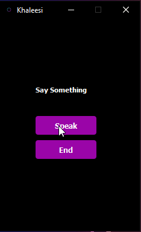

# Khaleesi (Voice Assistant)

Khaleesi is a simple personalized speech recognition assistant for your desktop that can be used to automate various processes.



#### Features

* Simple Interface
* Easy Personalization
* Commands (Romantic Mode, Sad Mode, Jokes, Automation)
* Check 'commands.txt' for the current commands in the app

#### Installation
1. Clone 
2. Install requirements.txt
3. Play around with the code and run 

```python
pip install -r requirements.txt
```